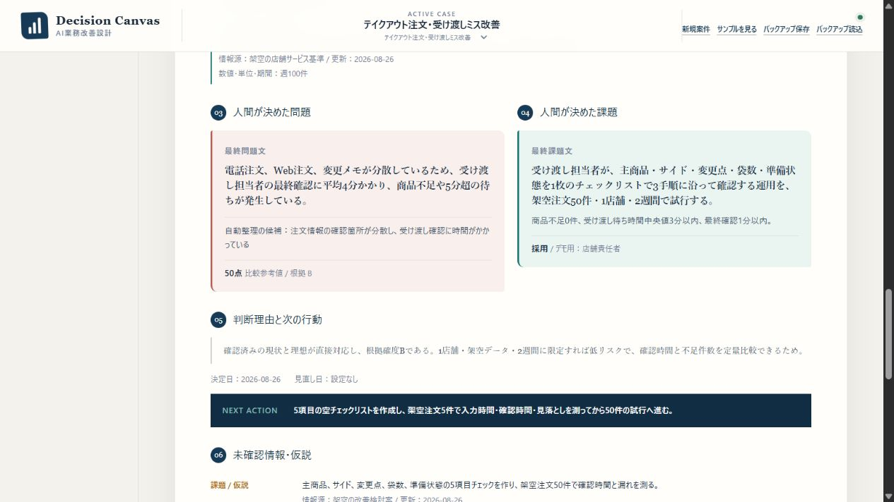
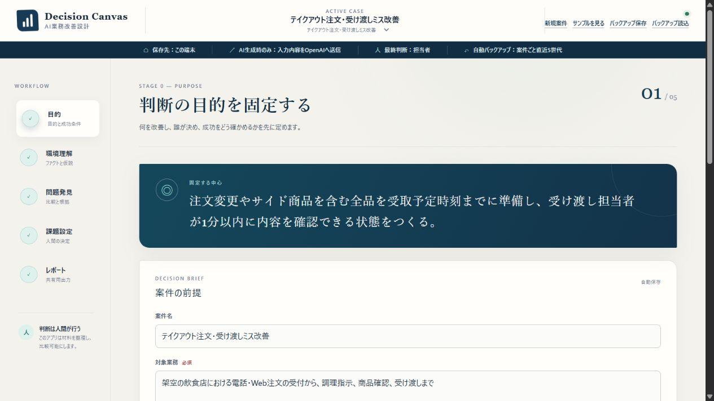
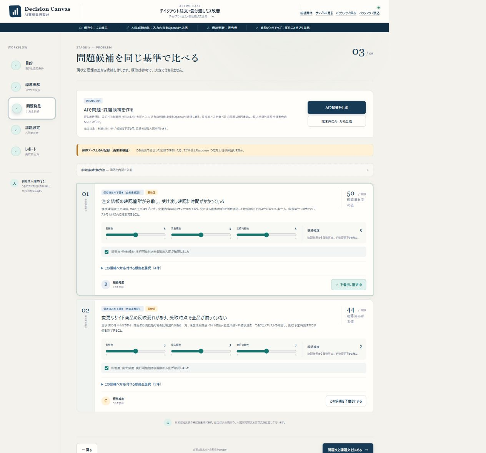

# Decision Canvas

[](https://github.com/AyaneRan/decision-canvas/actions/workflows/ci.yml)

現場の情報を整理・定量化し、AIの下書きと人間の最終判断を分離して記録する、業務改善向けの意思決定支援アプリです。

> A human-in-the-loop decision-support prototype for turning scattered business facts into comparable problems, actionable tasks, and an accountable final decision.

**v1.0.0 / ローカル単一利用版**



## 解決したい問題

業務改善では、事実・目標・仮説・結論が混ざり、もっともらしいAI出力がそのまま意思決定として扱われがちです。Decision Canvasは、次の順序を画面と記録で固定します。

1. 目的・対象・成功の確認方法を定める
2. 判断材料を7分類で整理し、確認状態と情報源を付ける
3. AIまたは端末内ルールが問題・課題候補を下書きする
4. 人間が根拠と評価を確認し、採用・保留・却下を決める
5. 最終文・判断理由・次の行動を固定記録として残す

## 現時点で証明できていること

| 項目 | 結果 | 証拠 |
|---|---|---|
| 架空データによる機能評価 | 5ケース中5ケースで期待動作を確認 | [評価結果](docs/evaluation/EVALUATION_RESULTS_v1.0.0.md) |
| 自動検証 | 40件中40件合格、Lint・型検査・本番ビルド合格 | [検証記録](docs/release/VERIFICATION_v1.0.0.md) |
| 人間による正式判断 | 架空デモ2件で最終文・理由・次の行動を確定 | [デモ証跡](docs/evidence/README.md) |
| 実業務での改善効果 | 未測定 | [ケーススタディ](docs/portfolio/CASE_STUDY.md) |

この評価は機能の動作確認です。初見利用者の操作性、業務時間の短縮、ミス削減、組織導入の安全性を証明するものではありません。

## 画面

以下はすべて、実在する会社・顧客・従業員・案件を元にしない架空データです。

### 環境理解



### 問題候補の比較

同じ算式で比較しても、点数は結論にしません。根拠確度BとCを分け、人間が採用候補を選びます。



## AIと人間の分界

| AI・端末内ルール | 人間 |
|---|---|
| 入力済み情報の整理 | 目的と成功条件を決める |
| 問題・課題候補の下書き | 根拠と評価を確認する |
| 共通算式による比較補助 | 候補を採用・保留・却下する |
| API障害時の安全なフォールバック | 最終文・理由・次の行動を確定し、責任を持つ |

アプリは、根拠確度Cでの採用、現状・理想が不足した状態での分析、入力変更後の古い判断の再利用を止めます。APIを使えない場合は理由を表示し、OpenAI生成と誤表示せず端末内ルールへ切り替えます。

## 主な機能

- 判断材料を「ビジネスモデル・現状・理想・問題・原因・示唆・課題」の7分類で記録
- 確認済み・一部確認・未確認・仮説、情報源、数値・期間を分離
- 明示操作時だけOpenAI Responses APIへ必要最小限の入力を送信
- 候補の影響度・発生頻度・根拠確度・実行可能性を0〜100の参考値へ換算
- 根拠と候補の対応付け、評価確認、正式判断ゲート
- 確定時点のスナップショットとMarkdownレポート
- 複数案件の端末内保存、直近5世代の自動バックアップ、JSONバックアップ・復元
- 別タブ競合の検知と、元案件を上書きしない退避

## ローカルで起動

前提：Node.js 22.13.0以上、pnpm 11.19.0。

```powershell
pnpm install --frozen-lockfile
pnpm run dev
```

起動後、`http://localhost:3000/`を開きます。APIキーがなくても端末内ルールによる候補生成を利用できます。

## OpenAI APIを使う場合

`.env.example`を参考に、Git管理外の`.env.local`を作成します。

```text
OPENAI_API_KEY=ここに自分のAPIキー
OPENAI_MODEL=gpt-5.4-mini-2026-03-17
```

APIキーはサーバー側だけで読み込みます。`NEXT_PUBLIC_`を付けたり、ソースコードやGitへ保存したりしないでください。

## 検証

```powershell
pnpm run verify
```

Lint、型検査、意思決定エンジンとAPI経路の40件のテスト、本番ビルドを順に実行します。

## 構成

- [`app/decision-workbench.tsx`](app/decision-workbench.tsx)：5段階ワークフロー、端末保存、正式レポート
- [`app/decision-engine.ts`](app/decision-engine.ts)：候補生成、比較式、判断ゲート、データ移行
- [`app/ai-analysis.ts`](app/ai-analysis.ts)：AI入出力の検証と正規化
- [`app/api/analyze/route.ts`](app/api/analyze/route.ts)：OpenAI Responses APIへのサーバー側接続
- [`scripts/`](scripts)：意思決定エンジンとAPI経路の自動テスト
- [`docs/architecture/ARCHITECTURE.md`](docs/architecture/ARCHITECTURE.md)：データフローと信頼境界

## 現在の境界

- ソースコードは閲覧できますが、アプリ自体は公開デプロイしていません。
- `.openai/hosting.json`とCloudflare・Sites向けの設定はローカルビルド互換性のための構成であり、公開承認やデプロイ済みであることを示しません。
- 公開環境向けの認証、権限管理、利用者別の永続的な回数制限は未実装です。APIキーを設定したままインターネットへ公開しないでください。
- 案件データはブラウザの端末内ストレージへ保存します。共有DB、リアルタイム共同編集、Excel・Teams連携は未実装です。
- 「AIで候補を生成」を押した時だけ、対象業務・目的・成功条件・制約・入力済み判断材料をOpenAIへ送信します。案件名・決定者・判断履歴・下書き履歴は送りません。
- API呼び出しは`store: false`を指定しますが、組織契約上のゼロデータ保持を意味しません。
- 端末保存とJSONバックアップには暗号署名がありません。
- 比較点とAI出力は補助情報です。最終判断と責任は人間に残します。
- 実会社データを使う試行は、対象・データ・責任者・費用・保存・停止条件の承認を得るまで行いません。

脆弱性の連絡方法は[SECURITY.md](SECURITY.md)、詳細な運用条件は[運用境界](docs/security/OPERATING_BOUNDARY.md)を参照してください。

## ドキュメント

- [v1.0.0 リリースノート](docs/release/RELEASE_NOTES_v1.0.0.md)
- [リリース検証記録](docs/release/VERIFICATION_v1.0.0.md)
- [5ケース評価計画](docs/evaluation/EVALUATION_PLAN.md)
- [5ケース評価結果](docs/evaluation/EVALUATION_RESULTS_v1.0.0.md)
- [完成デモ2件の証跡](docs/evidence/README.md)
- [3分デモ台本](docs/portfolio/DEMO_SCRIPT.md)
- [ケーススタディ](docs/portfolio/CASE_STUDY.md)
- [小規模試行の相談票](docs/pilot/PILOT_PLAN.md)

## ライセンス / License

Copyright © 2026 AyaneRan. All rights reserved.

このリポジトリはポートフォリオとしての閲覧目的で公開しています。オープンソースライセンスは付与していません。GitHubの利用規約上認められる閲覧・フォークを除き、事前の書面による許可なく、コードや文書の使用、複製、変更、再配布、再許諾、販売、派生物作成を行うことはできません。第三者パッケージには各パッケージのライセンスが適用されます。

This repository is public for portfolio review only. No open-source license is granted. Except for limited viewing and forking permitted by GitHub's Terms of Service, you may not use, reproduce, modify, distribute, sublicense, sell, or create derivative works from this code or documentation without prior written permission. Third-party packages remain subject to their respective licenses.
