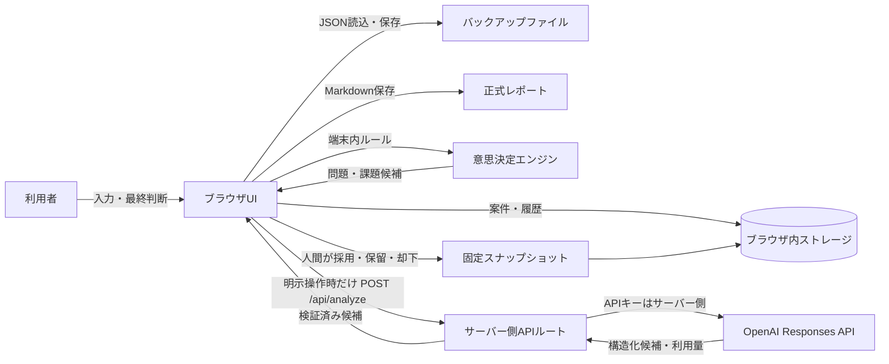
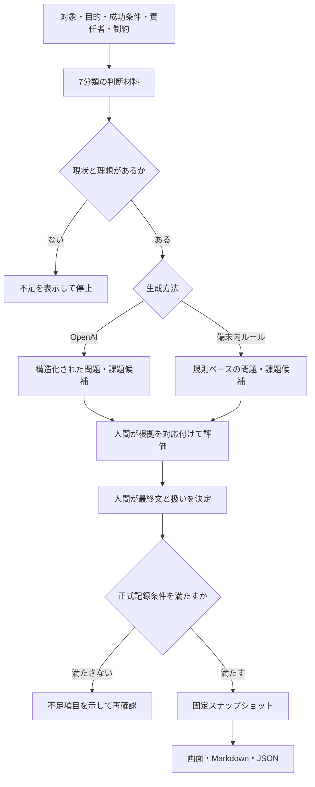

# Decision Canvas v1.0.0 アーキテクチャ

## 1. 全体像

現行版に共有データベース、利用者認証、リアルタイム共同編集はありません。利用者のブラウザが案件データの保存主体です。

## 2. 意思決定フロー

## 3. ブラウザ側

主な責務は次のとおりです。

- 案件コンテキストと7分類の判断材料の入力
- 候補比較、根拠対応、評価確認、人間の最終判断
- 入力変更時の分析指紋更新と、古い分析・判断の再確認要求
- 複数案件のブラウザ内保存
- 案件単位の直列保存、別タブ競合時の別案件退避
- 案件ごとの内部バックアップを直近5世代保持
- JSONバックアップの書き出し・読込
- 正式記録のコピーとMarkdown保存

端末保存データとJSONバックアップには暗号署名がありません。再読込・インポート由来のOpenAIメタデータは、実行中に受信したものと同じ信頼状態では扱いません。

## 4. 意思決定エンジン

意思決定エンジンは、候補、評価、根拠確度、正式記録条件、保存形式の整合性を扱います。

- 比較参考値：影響度35% + 発生頻度25% + 根拠25% + 実行可能性15%
- 根拠確度：A=5、B=3〜4、C=1〜2
- 未確認または仮説を含む根拠は低い確度へ制限
- 入力内容を指紋化し、古い分析を現行結果として使わない
- 正式確定時に案件前提、全材料、全候補、選択候補、評価、分析元を固定保存
- 保存データ読込時に型と参照関係を正規化し、不正な候補参照を現行判断へ復元しない

比較参考値は人間の優先順位判断を補助するだけで、自動採用には使いません。

## 5. OpenAI API経路

ブラウザから`POST /api/analyze`を呼び、サーバー側APIルートがOpenAI Responses APIへ接続します。

サーバー側では次を実施します。

- 同一オリジン、JSON形式、要求サイズ、入力件数と文字数の検証
- ローカルの簡易レート制限
- APIキーを環境変数から読み込み、ブラウザへ返さない
- `store: false`、低いreasoning effort、構造化JSON Schemaを指定
- 外部知識を足さず、入力済み情報だけを根拠にするよう指示
- 問題候補1〜5件、各課題候補1〜3件の構造と根拠IDを検証
- 拒否、タイムアウト、不正形式、上流障害をエラーコードへ変換
- モデル、Response ID、生成日時、トークン利用量を成功応答へ含める

APIが利用できない場合、ブラウザ側は理由を表示して端末内ルールの候補へ切り替えます。フォールバック結果をOpenAI生成とは表示しません。

## 6. データフロー

| データ | 保存先 | OpenAI送信 | 正式スナップショット |
|---|---|---:|---:|
| 対象業務・目的・成功条件・制約 | ブラウザ | 明示操作時のみ | 含む |
| 案件名・最終決定者 | ブラウザ | 送らない | 含む |
| 判断材料の本文・分類・状態・数値・情報源有無 | ブラウザ | 明示操作時のみ | 含む |
| 情報源の具体的名称 | ブラウザ | 送らない | 含む |
| 問題・課題候補と評価 | ブラウザ | OpenAIから受信、または端末生成 | 含む |
| 採用・保留・却下、最終文、判断理由 | ブラウザ | 送らない | 含む |
| APIキー | サーバー環境変数 | 認証ヘッダーとしてOpenAIへ | 含まない |
| Response ID・モデル・トークン利用量 | ブラウザ | OpenAIから受信 | 含む |

## 7. 信頼境界と本番化条件

判断材料の本文は信頼できない入力として扱い、本文中の命令に従わないようAPIへ指示します。ただし、プロンプトインジェクションや誤出力を完全に防ぐ保証はないため、出力は下書きに限定し、人間の確定操作を必須にします。

現行の簡易レート制限は単一プロセス内の記録であり、公開・分散環境の費用防止策にはなりません。本番化には認証、権限、共有DB、監査、暗号化、利用上限、監視、復旧、契約確認が必要です。詳細は[運用境界](../security/OPERATING_BOUNDARY.md)を参照してください。

起動方法と環境変数は[README](../../README.md)を参照してください。
